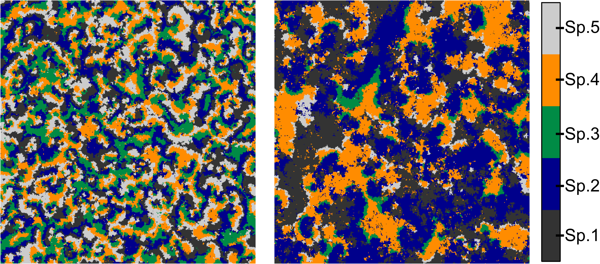

The CLS1D package provides facilities for estimating the Characteristic Length Scale of natural systems from 1-dimensional spatial (transect) data. 

Please refer to Ward et al (submitted) for detailed explanation, testing and application of the methods presented here. 

## Contents

* Data
* Sliding window approach
  * Setting the maximum window size
  * Other parameters
* Short time-series approach


```{r, echo=FALSE}
library(CLS1D)
```

## Data available for testing

Below is an image of a model system containing 5 interacting species. The left image is a snapshot of the landscape after it has evolved according to set competition rules for 5000 time steps. The right image is the same landscape section after a further 5000 timesteps with altered competition rules.

```{r, out.width = "600px", echo=FALSE}

```

Transect data from this system is available to test both the sliding window approach, and the short time-series approach.

`regime1_sw` and `regime2_sw` contain a transect across the landscape shown in the top, and bottom image respectively. The five species are numbered 1 to 5, and each cell along the transect contains one species.

```{r}
str(regime1_sw)
```

There are also some coral reef data available for testing the package on transect data from a real ecosystem. 

`bb2007` contains a transect of benthic morphotype data from Blue Bowl Reef slope in 2007. For every centimetre along this 60 metre transect, the benthic cover has been recorded. `bb2010` is a transect from the same reef in 2010. This data and its metadata (eg morphotype codes) is accessible from [Haapkyla et al (2016)](https://doi.org/10.4226/77/587E953EBFDB3).


## Sliding window approach

To calculate the CLS, we want only the spatial patterns of a single species, so we set the all the occurrences of the target species to `1` (present in the cell) and all other species to zero (target species not present).

```{r}
x <- ifelse(regime1_sw == "2", 1, 0) #species 2
```

Use `CLS1D()` to estimate Error X (the preferred metric for use with the sliding window approach) or prediction r-squared.

```{r}
set.seed(2)
ex <- CLS1D(x, Lhalf=20, d=3, metric="errX", n.samples=20)
```

`plotCLS()` provides functionality for plotting the spectra

```{r, fig.width=6, fig.height=6}
plotCLS(ex, metric="errX", ylim=c(0,1), xticks = 5)
```

The CLS is defined as the window size at which the curve begins to plateau. In this case, the CLS is 15-20 pixels. 

We can now compare the CLS from that first regime to the CLS in the second regime.

```{r, fig.width=6, fig.height=6}
set.seed(2)
x <- ifelse(regime2_sw == "2", 1, 0) #species 2 from regime 2
ex <- CLS1D(x, Lhalf=20, d=3, metric="errX", n.samples=20)
plotCLS(ex, metric="errX", ylim=c(0,1), xticks = 5)
```

The CLS has increased to 25-30 pixels in this second regime.


For interest sake, we can compare the curve produced from these model ecosystems, to that of a random distribution of species. 

```{r, fig.width=6, fig.height=6}
x <- floor(runif(6000, 0,5)) #randomly distributed species
ex <- CLS1D(ifelse(x == "2", 1, 0), Lhalf=20, d=3, metric="errX", n.samples=20)
plotCLS(ex, metric="errX", ylim=c(0,1), xticks = 5)
```

### setting the maximum window size

We can also change the `Lhalf` metric. This sets the half maximum window size. So in the above examples, the maximum window size was 40 (`Lhalf=20`). Let's change that to `Lhalf=50` below to estimate the CLS of regime 2 again.

```{r, fig.width=6, fig.height=6}
set.seed(2)
x <- ifelse(regime2_sw == "2", 1, 0) #species 2 from regime 2
ex <- CLS1D(x, Lhalf=50, d=3, metric="errX", n.samples=20)
plotCLS(ex, metric="errX", ylim=c(0,1.3), xticks = 5)
```

There are two issues here. Increasing the maximum window size: 

* made the curve appear more 'bumpy'
* potentially altered the interpretation of the CLS.

Firstly, the error X spectra have an increasingly bumpy appearance as the maximum window size is increased. This is because there is less replication of the larger window sizes (fewer of the large window sizes fit along the transect than do smaller windows). To deal with any bias in predictive power this would produce between small and large windows, the sample size of all windows is standardised, according to the number of sample trajectories available at the largest window size. Therefore, as the maximum window size is increased, the sample size used to calculate the prediction error for all window sizes decreases, resulting in more variable estimates. In this example, the spectra is only a little bit bumpy, so there is not too much cause for concern. If the spectra is *very* bumpy, then either the maximum window size should be decreased, or, a longer transect is required.

Secondly, the interpretation of the CLS could potentially be different. The change in interpretation of the CLS is more of a concern in this case. If you look closely the CLS still appears to be about 25-30 pixels, but it becomes increasingly difficult to determine this as the perspective changes (eg as the maximum window size is increased). It is therefore important to keep the maximum window size consistent when comparing CLSs between systems/time-steps.


### Real world transect data
Test the method on real ecosystem data: Blue Bowl reef benthic transect data in 2007

```{r, fig.width=6, fig.height=6}
set.seed(2)
x <- ifelse(bb2007 == "CF", 1, 0) #foliose coral from 2007
ex <- CLS1D(x, Lhalf=20, d=3, metric="errX", n.samples=20)
plotCLS(ex, metric="errX", ylim=c(0,1), xticks = 5)
```

We can see from the figure above that in this case, a maximum window size of 40 (`Lhalf=20`) is not large enough to capture the CLS of the system. We therefore need to increase the maximum window size.

```{r, fig.width=6, fig.height=6}
set.seed(2)
x <- ifelse(bb2007 == "CF", 1, 0) #foliose coral from 2007
ex <- CLS1D(x, Lhalf=50, d=3, metric="errX", n.samples=20) #max window size = 100cm
plotCLS(ex, metric="errX", ylim=c(0,1.5), xticks = 5)
```

The CLS looks to be about 65 cm in 2007. We can see that the spectra above has a slightly 'bumpy' appearance. This is due to the lack of replication of larger window sizes. This example is not too bad, but it would not be a good idea to increase the maximum window size further. Ideally, we would have a longer transect to be able to increase replication for the larger window sizes. But, with real data, that is not always possible, as in this case where the data was collected for a different purpose. The main test will be, whether all of the time-steps you want to compare have a CLS which falls within the same range.

Let's determine CLS for the same reef in 2010.

```{r, fig.width=6, fig.height=6}
set.seed(2)
x <- ifelse(bb2010 == "CF", 1, 0) #foliose coral from 2010
ex <- CLS1D(x, Lhalf=50, d=3, metric="errX", n.samples=20) #max window size = 100cm
plotCLS(ex, metric="errX", ylim=c(0,1.5), xticks = 5)
```

For this system in 2010, the CLS had fallen to about 30-40 cm.

### other parameters

Other parameters that you can change in the `CLS1D()` function include the embedding dimension `d`, the `k` number of nearest neighbours used in the predictions, the number of sets of random samples used to estimate the prediction error for each window size `n.samples`. 

#### `d`

In the sliding window method, the dimension `d` is the number of window positions along the transect you track your target species for, before predicting its density in the `d+1`^th^ window position. In our preliminary testing, changing `d` did not markedly alter the CLS estimated from the spectra. 

Let's check to be sure. Using the same example as above (Blue Bowl reef in 2010), we'll increase the embedding dimension to `4`. (Setting the same random seed as before, so that we are comparing the same thing).

```{r, fig.width=6, fig.height=6}
set.seed(2)
x <- ifelse(bb2010 == "CF", 1, 0) #foliose coral from 2010
ex <- CLS1D(x, Lhalf=50, d=4, metric="errX", n.samples=20) #d = 4
plotCLS(ex, metric="errX", ylim=c(0,1.5), xticks = 5)
```

This time the CLS looks to be between 30 and 40 cm, so changing the embedding dimension did not really alter our interpretation of the CLS. 

It should be noted that increasing `d` will mean that fewer samples of species trajectories will exist for the larger window sizes.

```{r, fig.width=6, fig.height=6}
set.seed(2)
x <- ifelse(bb2010 == "CF", 1, 0) #foliose coral from 2010
ex <- CLS1D(x, Lhalf=50, d=2, metric="errX", n.samples=20) #d = 2
plotCLS(ex, metric="errX", ylim=c(0,1.5), xticks = 5)
```

Setting `d=2` likewise has not altered our interpretation of the CLS - it still looks to be 30-40 cm. However, in some cases the interpretation will change, so it is important to a) be consistent with the choice of `d`, and b) always report the embedding dimension used.

#### `k`

The k-nearest neighbours determines how many neighbouring points in the reconstructed attractor are used to predict the trajectory from each point. 

We can check a few different settings of `k` to observe the effect that it has (using the same coral reef example as above). First we'll try `k=10`

```{r, fig.width=6, fig.height=6}
set.seed(2)
x <- ifelse(bb2010 == "CF", 1, 0) #foliose coral from 2010
ex <- CLS1D(x, Lhalf=50, d=3, metric="errX", n.samples=20, k=10) #k = 10
plotCLS(ex, metric="errX", ylim=c(0,1.5), xticks = 5)
```

Again, the CLS still looks to be between 30 and 40 cm.

Let's try a smaller number: `k=2`

```{r, fig.width=6, fig.height=6}
set.seed(2)
x <- ifelse(bb2010 == "CF", 1, 0) #foliose coral from 2010
ex <- CLS1D(x, Lhalf=50, d=3, metric="errX", n.samples=20, k=2) # k = 2
plotCLS(ex, metric="errX", ylim=c(0,1.5), xticks = 5)
```

This time the CLS looks slightly larger: 35-45 cm. As with `d`, it is best to keep `k` consistent.

#### `n.samples`

`n.samples` refers to the number of sets of samples used to calculate the prediction error metric for each window size. This can be changed, but `n.samples=20` is standard.

## Short time-series approach

In the short time-series approach to CLS estimation, repeat transect data is collected in the same location over 4 or more time steps. Then, the trajectory of the species density is tracked over the first three timesteps, to predict the target species density in the final time-step.

To illustrate this approach, `Sp2R1_sts` and `Sp2R2_sts` are short time-series of species 2 in regime 1 and 2 (respectively) for the model described at the top of this vignette. These are structured so that each row contains the transect from a different time-step (separated by 10 time-steps), and each row indicates the presence (1) or absence (0) of Species 2 in each cell along the transect. This is a delay embedding.  

```{r}
head(Sp2R1_sts)
```

The `CLS1Dsts()` function takes time-delayed transect data and uses the short time-series approach to estimate either error X (`metric="errX"`) or prediction r^2^ (`metric="PRSq"`). Unlike with the sliding window approach, we do not need to specify the embedding dimension as this is determined by the number of time-steps in the matrix `x` (the number of columns).

```{r, fig.width=6, fig.height=6}
set.seed(2)
x <- CLS1Dsts(Sp2R1_sts, Lhalf=20, metric="errX", n.samples=20)
plotCLS(x, metric="errX", ylim=c(0,1), xticks=5)
```

This looks as though it sufficiently captures the CLS (around 15 pixels), but we can double check by increasing Lhalf.

```{r, fig.width=6, fig.height=6}
set.seed(2)
x <- CLS1Dsts(Sp2R1_sts, Lhalf=40, metric="errX", n.samples=20)
plotCLS(x, metric="errX", ylim=c(0,1), xticks=5)
```

With a larger maximum window size, the CLS still looks to be about 15 pixels.


We can also test to see whether we could estimate the CLS from a smaller number of time-steps. For example, use the first two time-steps to predict the third.

```{r, fig.width=6, fig.height=6}
set.seed(2)
x<- Sp2R1_sts[,1:3]
x<- CLS1Dsts(x, Lhalf=20, metric="errX", n.samples=20)
plotCLS(x, metric="errX", ylim=c(0,1), xticks=5)
```

Still looks ok, and the CLS still looks to be about 15 pixels. But this doesn't always work - it is better to have more time-steps.

We can also use prediction r^2^ as the metric.

```{r, fig.width=6, fig.height=6}
set.seed(2)
x <- CLS1Dsts(Sp2R1_sts, Lhalf=20, metric="PRSq", n.samples=20)
plotCLS(x, metric="PRSq", ylim=c(0,1))
```

For prediction r^2^ a maximum window length of 40 pixels is not large enough to capture the CLS. Let's try 80 pixels.

```{r, fig.width=6, fig.height=6}
set.seed(2)
x <- CLS1Dsts(Sp2R1_sts, Lhalf=40, metric="PRSq", n.samples=20)
plotCLS(x, metric="PRSq", ylim=c(0,1))
```

This is still not large enough to capture the CLS using this metric. 

```{r, fig.width=6, fig.height=6}
set.seed(2)
x <- CLS1Dsts(Sp2R1_sts, Lhalf=100, metric="PRSq", n.samples=20)
plotCLS(x, metric="PRSq", ylim=c(0,1))
```

Even increasing the maximum window length to 200 pixels suggests that prediction r^2^ is unlikely to be an appropriate metric for use with this combination of method and system, as the shape of the prediction r^2^ spectra is not readily interpretable. 


If we turn back to error X, we can also determine the CLS  of the system after the dynamics of the model simulation had changed.

```{r, fig.width=6, fig.height=6}
set.seed(2)
x <- CLS1Dsts(Sp2R2_sts, Lhalf=20, metric="errX", n.samples=20)
plotCLS(x, metric="errX", ylim=c(0,1), xticks=5)
```

The CLS in this second regime looks to be about 10 pixels. The change in regime in this system is less readily observable using the 1D short time-series approach than it was using the 1D sliding window approach. 

## References

####cited
Haapkyla, Melbourne-Thomas, Flavell & Ward (2016). Hoga coral reef benthic community transect data. [Data set]. Australian Ocean Data Network, https://doi.org/10.4226/77/587E953EBFDB3.

Ward, Wotherspoon, Melbourne-Thomas, Haapkyla & Johnson (submitted). Detecting ecological regime shifts from transect data.


####other examples of CLS estimation (2D and long time-series)
Habeeb, Trebilco, Wotherspoon & Johnson (2005). Determining natural scales of ecological systems. Ecological Monographs 75:467-487.

Habeeb, Johnson, Wotherspoon & Mumby (2007). Optimal scales to observe habitat dynamics: A coral reef example. Ecological Applications 17:641-647.

Johnson (2009). Natural length scales of ecological systems: Applications at community and ecosystem levels. Ecology and Society 14.

Johnson, Chabot, Marzloff & Wotherspoon (2017). Knowing when (not) to attempt ecological restoration. Restoration Ecology 25:140-147.

Keeling, Mezic, Hendry, McGlade & Rand (1997). Characteristic length scales of spatial models in ecology via fluctuation analysis. Philosophical Transactions of the Royal Society of London Series B-Biological Sciences 352:1589-1601.

Pascual & Levin (1999). From individuals to population densities: Searching for the intermediate scale of nontrivial determinism. Ecology 80:2225-2236.

####background for attractor reconstruction and nonlinear methods
Kantz & Schreiber (2003). Nonlinear Time Series Analysis. 2nd edition. Cambridge University Press, Cambridge, UK.
